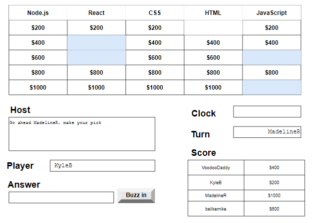
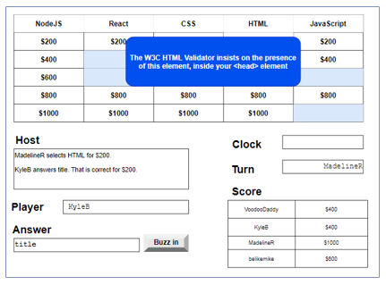

# Topic Tempest Design Notes

An informal and frequently changing container for policy, requirements, design notes, sketches, etc.
in order to help out with building this product.

### Team members

- Kyle Bernardes CWID 10412644
- Mahima Chandan CWID 10467889
- Dale Pippert CWID 10469880
- Madeline Rys CWID 10416134

### GitHub URLs

#### Topic Tempest project site

<a href="https://github.com/madelinerys/CS554FinalProject">
https://github.com/madelinerys/CS554FinalProject</a>

#### Topic Tempest Technical Implementation Plan 

*Significant changes have been made to the design since this plan was submitted.*

<a href="https://github.com/madelinerys/CS554FinalProject/blob/master/doc/TechImplementationPlan.md">
https://github.com/madelinerys/CS554FinalProject/blob/master/doc/TechImplementationPlan.md
</a>

#### Topic Tempest Design Notes (this document) 

<a href="https://github.com/madelinerys/CS554FinalProject/blob/master/doc/DesignNotes.md">
https://github.com/madelinerys/CS554FinalProject/blob/master/doc/DesignNotes.md
</a>

## Terminology

**Buzz in**. Player presses the Buzz in button on UI to submit their answer to the current
question.

**Firebase RTDB**. Google Firebase Realtime Database.

**Page**. As a single page application, references to *page* refer to a client-side route
and not a physical post back to the server to fetch a new HTML page.

**Q/A**. Questions and Answers.

**SPA**. Single Page Application. The application is downloaded from the NodeJS server
on startup and from then-on runs in the browser. Only data fetches are made from the server
after the initial download of the application.

**TTS**. Text-to-speech.

**Username**. A unique alphanumeric name chosen by a visitor who has decided they
want to play Topic Tempest. See also **Visitor**.

**Visitor**. This is the term for a person who has come to the site but has not
yet created and entered their game play **Username**.

## Project Overview

Topic Tempest consists of a backing Q/A database accessible through a GraphQL API. A UI
gives authenticated users the ability to CRUD against the Q/A database. While the Q/A
database is useful in its own right to support many different types of learning applications,
Topic Tempest will include one such application. This is a Jeopardy-like game where
players compete in a multiplayer contest to see who can score the most points through
a question/answer game format. 

## Application architecture

1. UI is a *single page application (SPA)* based on the React framework. SPA is served
from an Apollo GraphQL Node.js server. Their are two application databases. The first
is a Mongo database holding questions and answers that are used during game play. The
second database is a Firebase *realtime database* that synchronizes game state across
browsers.

## Authentication

Authentication comes in two flavors depending on whether you are simply *playing*
or if you want to perform CRUD operations against the Q/A database.

### Game play authentication

1. Game play is open and "free-spirited" in that users do not authenticate
in order to play.

1. Visitors create and enter a simple temporary username that lasts only for
the duration of the game.

1. From landing page, visitors are met with brief description of
the game and a single **Ready to Play** button.

1. Pressing **Ready to Play** prompts visitors to enter a username to use for the
duration of the game that is about to ensue.

1. Username will have some restrictions as to characters allowed and length TBD.

1. Username is not stored and is only used to provide session uniqueness for the
duration of the game.

### Q/A database authentication

1. Users who wish to administer (CRUD) the Q/A database must authenticate.

1. Authentication must include functionality for both Sign up (new user)
and Sign in (existing user).

1. Authentication must support native (Tempest username/password).

1. Authentication must support at least one third-party identity provider (Google, Facebook,
Twitter, GitHub, Amazon, etc.).

1. Once authenticated users are directed to a screen where they can CRUD against
the Q/A database.

1. Authenticated users do not need to see or get to the game play screen.

1. Support provided for changing your password only time-permitting.

## Enrolling in a game 

1. From the landing page, a visitor decides they want to play by pressing *Ready to Play*.

1. Pressing *Ready to Play* prompts the visitor to create and enter a username. This
username lasts only for the duration of the game.

1. Once the visitor creates their username, they become a "player" and are put into
an enrollment queue where they wait until a quorum (typically
2 or 3) of other players have enrolled.

1. Entry of the username is done through a simple text box and *Enter* button.

1. Once the quorum of players has been reached, the game begins.

## Game play

1. Game play begins by directing players to the game screen, where a game board appears.

1. The game board appears as a matrix with a top row of 5 hidden topic names.
Each topic consists of a column of 5 hidden questions (for a total of 25 questions for the game).

1. Game board is on the upper portion of a player's screen.

1. Lower portion of the game player screen consists of various status, monitoring, and
control resources. 

1. All game play occurs on game screen.

1. Game board is a matrix of 30 squares or rectangles.

1. Game board is divided vertically into five topics. Each topic is a column in
the matrix.

1. There are five hidden questions for each topic.

1. Each question on the game board is hidden behind a square with either $200,
$400, $600, $800, or $1000 printed on the square.

1. Dollar value printed on each square represents that question's worth to win (+)
or lose (-).

1. A player wins dollar amount of a question by being the first to answer that question
correctly.

1. Whoever's turn it is, must start the round by clicking an available question square in
the game board matrix.

1. Question appears in a pop up dialog box, as well as in host guidance region.

1. Once question appears, a 15 second timer starts in which players may attempt to
answer the question.

1. Players are not required to attempt an answer.

1. The first player to answer a current question correctly, wins the $ amount for
that square on the board.

1. Squares are rated as $200, $400, $600, %800, and $1000 from top to bottom

1. Each player has a **Balance** text box that updates whenever a player wins
or loses in a round with the $ amount of the square (plus (win) or minus (lose)).

1. Players can see all other players names and balances at all times.

1. Players cannot see other players answers or if they have answered at all.

1. Topics, and the questions making up a topic, are hidden to start the game.

1. System reveals the topics one by one to start the game. As each topic is revealed
it is also written to the host guidance region.

1. Only topic names are revealed during topic reveal -- questions remain hidden.

1. Topics are revealed left-to-right with approximately three seconds pause between
announcing of each topic.

1. Players are not directed to game screen until a quorum of players have been
assembled by the system.

1. Guidance text area box informs waiting players whenever there is a new arrival
(enrollee) to the game.

1. System will decide what player will start the game.

1. Each question/answer pair is considered a *round*.

1. Player's turn is communicated via host guidance.

1. All player's have approximately 15 seconds on clock to answer the current
question.

1. Host guidance will inform players when 10 seconds remain to answer the question.

1. When time has expired for a question, players' *Buzz in* button disables, thus
preventing an answer attempt.

1. A player answers a question by typing their answer into an **Answer** text box
and clicking the **Buzz in** button.

1. Question pops up in *non-modal* box (so that player can type while question is active).

## Guidance text area control 

1. A text area control is used to assist all players including vision-impaired on
the status and directions for the game.

1. This text area control is herein referred to a *host guidance* region.

1. Game is equipped with a TTS API to assist with players who may be vision-impaired.

1. Text appearing in host guidance is also submitted to the TTS module for
speaking.

1. Host guidance is read-only to players and only written to by the system.

1. Host guidance is a box with directions and status information as the
game proceeds.

## Game board mockups

The following depiction of a game board shows four players. Two React
questions and two JavaScript questions have already been asked. This is KyleB's
browser. It is MadelineR's turn. The system is waiting for her to click one
of the open squares.

In a follow-on depiction of the above game board, MadelineR has made her pick
of HTML for $200. KyleB has correctly buzzed in an answer of <code>title</code>.
The system has recorded a win of $200 for this answer.

## Q/A Database

A feature of the system is to allow authenticated users to manage topics and questions
as follows. This is the Q/A database.

1. List topics.

1. You cannot delete a topic and all its questions.

1. Create a new topic.

1. Add questions to a topic.

1. A question consists of a text question and an array of acceptable case-insensitive
answers to that question.

1. You cannot edit a topic name.

1. You cannot delete questions.

1. Edit (update) questions for any topic (update the question or answer).

1. Browse the list of questions for any selected topic, with pagination.

1. Do rudimentary searching of the database for questions and/or answers containing
some specified string.

1. Case and punctuation insensitive. 

1. Batch upload of topics and questions/answers not supported.

1. Maintain a seed file of questions and answers to seed the database with.

## Technical Implementation

### User interface (UI)

1, UI is based on React framework.

1. UI is broken into two logical layers, a presentation layer, and a business rules layer.

### Game engine

1. Game engine implements the business rules aka the game play rules as described above.

2. UI is driven by game engine that has captured most of the rules of game play.

3. Game engine sends events to UI for the UI to act upon.

1. Game engine utilizes Firebase RTDB to keep game state consistent across all
players browsers.

1. UI does not know that Firebase RTDB is being used.

### Q/A database

1. Game is supported by a Question and Answer (Q/A) Mongodb database.

1. Authenticated users have capability to author/edit Q/A entries in the Mongodb database.

## Work Breakdown

<table>
<tbody>
<tr>
  <th>Item</th><th>Developer</th>
</tr>

<tr><td>Initial application framework with Authentication</td><td>Mahima</td></tr>

<tr>
  <td>Authentication. Sign up/Sign in. One third-party identity provider (eg Google/Facebook/Twitter etc.)
supported in addition to Tempest itself.</td><td>Mahima</td>
</tr>

<tr>
  <td>Q/A database and user interface
and editing of topics and question/answer. Questions may have more than one correct answer.</td><td>Madeline</td>
</tr>

<tr>
  <td>React UI</td></td><td>Kyle</td>
</tr>

<tr>
  <td>TTS module</td><td>Kyle and Dale</td>
</tr>

<tr>
  <td>Game engine and Firebase RTDB schema</td></td><td>Dale</td>
</tr>

<tr>
  <td>Preparation of topics with questions/answers, creating seed file, and loading same into database.</td><td>All</td>
</tr>

<tr>
  <td>Video questions. Make videos for some questions and handle upload to
a storage provider somewhere.</td><td>TBD</td>
</tr>

## Project notes

1. Most drawings were prepared using <a href="https://draw.io">Draw I/O</a>.

</tbody>
</table>

